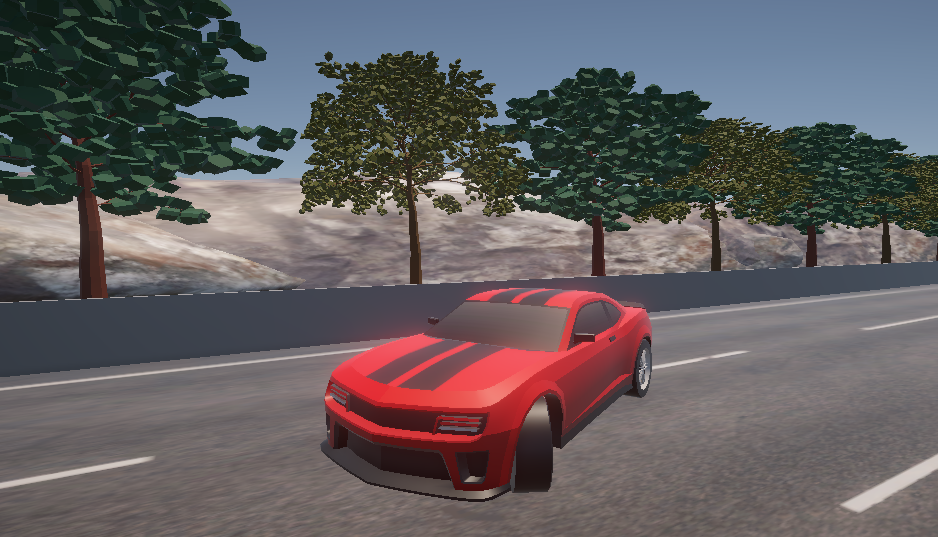
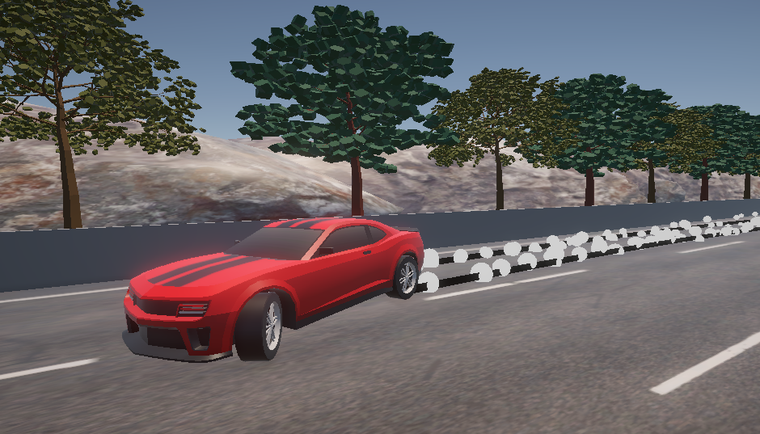
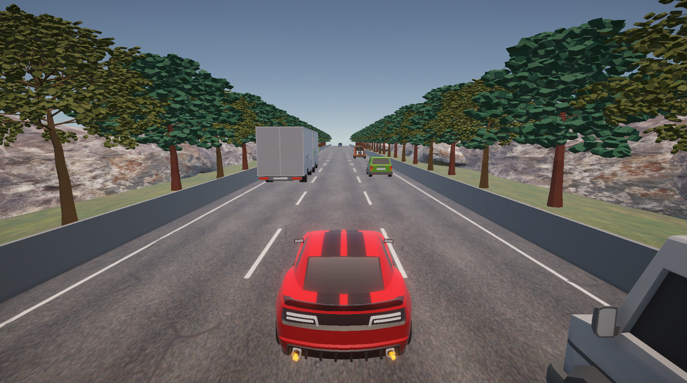
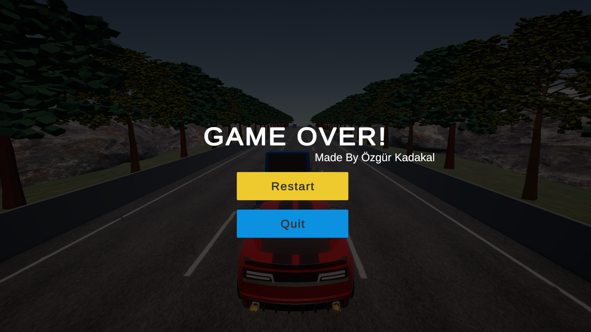
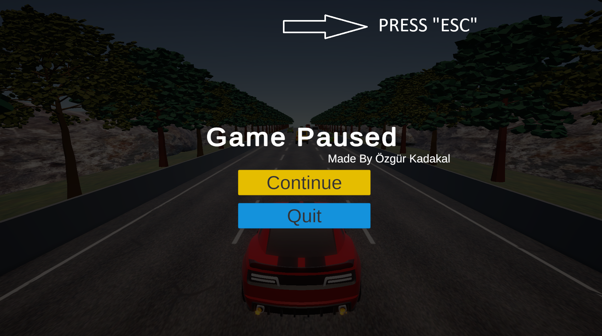
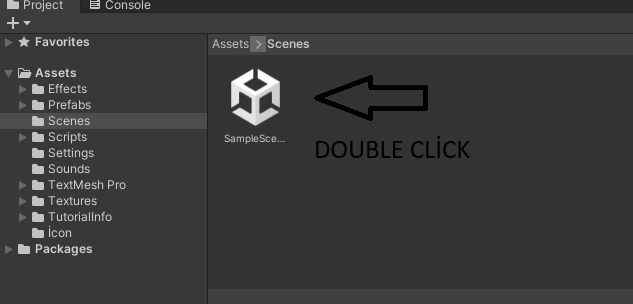
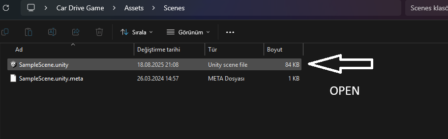

# 🚗 Endless Traffic Runner 🎮

### - Developed by Özgür Kadakal

**⚠️ Önemli:** İndirdiğiniz `.zip` dosyasını ayıklayıp projeyi bu şekilde açınız. Aksi takdirde proje düzgün şekilde çalışmayabilir.  

**⚠️ Important:** Please extract the downloaded `.zip` file before opening the project. Otherwise, it may not work properly.  

---

## 🖼️ Gameplay Previews

### 🎮 In-Game Screenshot 1

### 🎮 In-Game Screenshot 2

### 🎮 In-Game Screenshot 3

### 🎮 In-Game Screenshot 4

### 🎮 In-Game Screenshot 5

---

## 🌍 English

### 🚗 Endless Traffic Runner
An endless one-way traffic car game developed in Unity by **Özgür Kadakal**, featuring dynamic traffic, drift effects, and immersive sound design.  

### ✨ Features
- 🛣 Endless one-way road  
- 🚘 Continuously spawning cars with increasing speed  
- 💨 Drift effects with tire smoke  
- 🔊 Engine sounds, braking, and drifting audio  
- 🏁 Game Over screen with "Try Again" button  
- ⏸ Pause the game with **ESC** key  
- 🛞 Realistic wheel rotation and asphalt tire marks  
- 🎮 Smooth car controls and responsive gameplay  

---

## 🇹🇷 Türkçe

### 🚗 Sonsuz Trafik Oyunu
Unity ile **Özgür Kadakal** tarafından geliştirilmiş, tek yönlü sonsuz bir trafik araba oyunu, dinamik trafik ve etkileyici ses efektleri ile.  

### ✨ Özellikler
- 🛣 Sonsuz tek yönlü yol  
- 🚘 Sürekli spawnlanan arabalar ve hızlanma  
- 💨 Drift efekti ve lastik dumanı  
- 🔊 Motor sesi, fren ve drift sesleri  
- 🏁 Game Over ekranı ve "Try Again" butonu  
- ⏸ **ESC** tuşu ile oyunu duraklatma  
- 🛞 Lastiklerin gerçekçi dönme animasyonu ve asfalt izleri  
- 🎮 Akıcı araba kontrolleri ve responsive oynanış  

---

## 🛠 Unity Version | Unity Sürümü

- **2022.3.62f1**  
> This project was developed and tested with **Unity 2022.3.62f1**.  
> Proje, **Unity 2022.3.62f1** sürümü ile geliştirilmiş ve test edilmiştir. Aynı veya uyumlu bir sürümle açmanız tavsiye edilir.

---

## ⚠️ Important Notice | Önemli Uyarı

- **English:**  
  1. When opening the project through Unity Hub for the first time, loading may take a long time. This is normal as Unity will rebuild the Library folder.  
  2. On the first project launch, you will see an **empty scene** (no objects in the Hierarchy).  
     To load the game objects, go to the **`Assets/Scenes/`** folder and double-click on **`SampleScene`**.  
     Alternatively, you can open **SampleScene** directly from Unity Hub by double-clicking it in the **Project window** once the project has loaded.  
     Once loaded, the game will be ready to use.

- **Türkçe:**  
  1. Projeyi Unity Hub üzerinden ilk kez açarken yüklenme süresi uzun olabilir. Bu normaldir çünkü Unity, Library klasörünü yeniden oluşturacaktır.  
  2. Proje ilk açıldığında **Hierarchy tamamen boş** görünecektir (hiç obje olmayacaktır).  
     Oyun objelerini yüklemek için **`Assets/Scenes/`** klasörüne gidip **`SampleScene`** dosyasına çift tıklayın.  
     Alternatif olarak, proje yüklendikten sonra Unity Hub içerisindeki **Project penceresinden** de **SampleScene**’i çift tıklayarak açabilirsiniz.  
     Yüklendikten sonra oyun kullanıma hazırdır.

📸 **Screenshot:**  

---

## 📬 Contact | İletişim

For any feedback, questions, or suggestions, feel free to contact me:  
📧 ozgurkreach@gmail.com

Her türlü geri bildirim, soru veya öneri için:  
📧 ozgurkreach@gmail.com  
