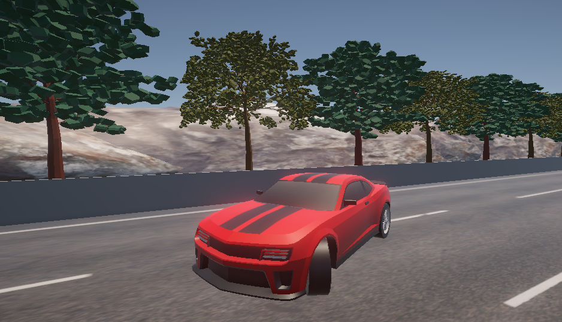
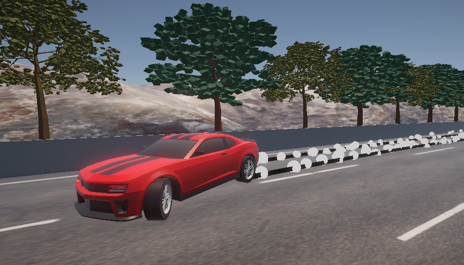
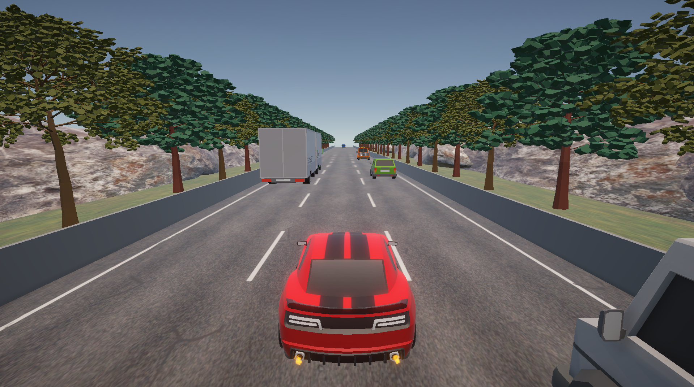
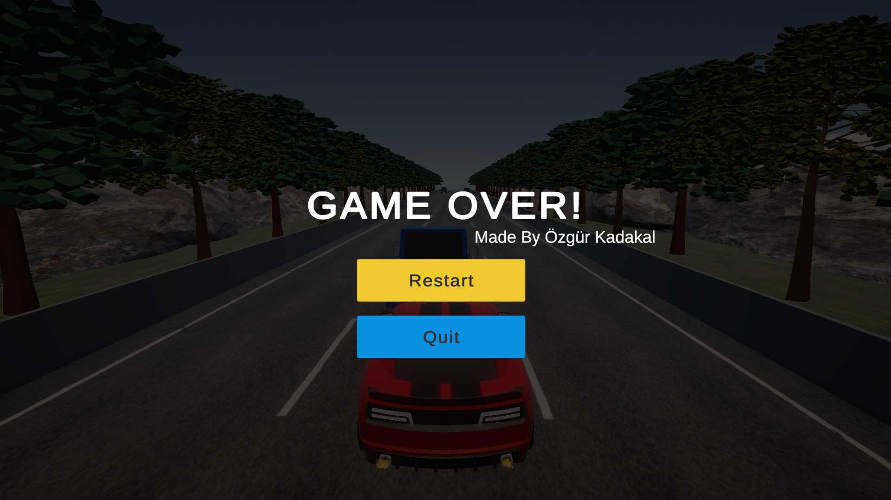
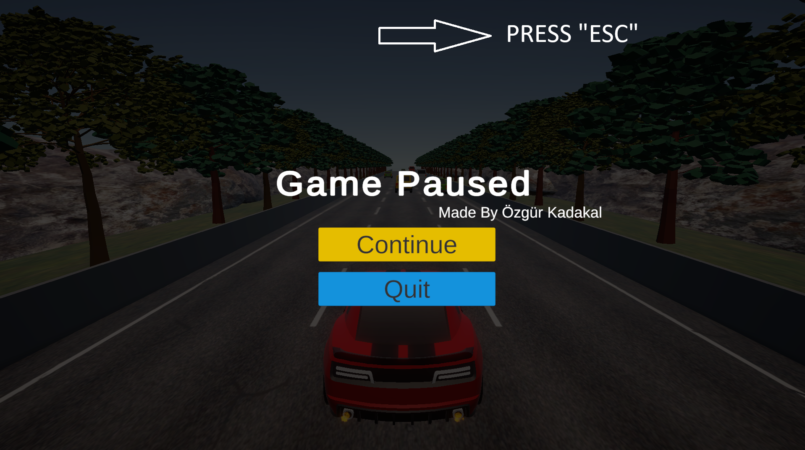
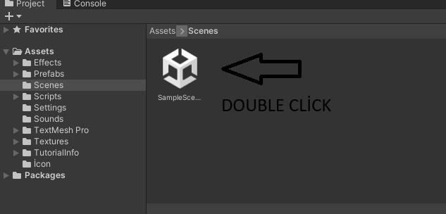
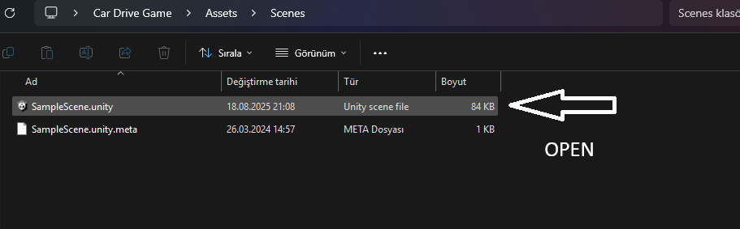

## 🌍 English

# 🚗 Endless Traffic Runne 🎮

### - Developed by Özgür Kadakal

**⚠️ Important:** Please extract the downloaded `.zip` file before opening the project. Otherwise, it may not work properly.  

**⚠️ Important:** Make sure the downloaded `.exe` file is named **`Car Drive Game.exe`**.If you rename it, the game will **not run properly**.

---

## 🖼️ Gameplay Previews

### 🎮 In-Game Screenshot 1

### 🎮 In-Game Screenshot 2

### 🎮 In-Game Screenshot 3

### 🎮 In-Game Screenshot 4

### 🎮 In-Game Screenshot 5

---

### 🚗 Endless Traffic Runner
An endless one-way traffic car game developed in Unity by **Özgür Kadakal**, featuring dynamic traffic, drift effects, and immersive sound design.  

### ✨ Features
- 🛣 Endless one-way road  
- 🚘 Continuously spawning cars with increasing speed  
- 💨 Drift effects with tire smoke  
- 🔊 Engine sounds, braking, and drifting audio  
- 🏁 Game Over screen with "Try Again" button  
- ⏸ Pause the game with **ESC** key  
- 🛞 Realistic wheel rotation and asphalt tire marks  
- 🎮 Smooth car controls and responsive gameplay

🧑‍💻 *This project was developed from scratch by Özgür Kadakal.*  
📌 *All code and assets are original.*

---

## 📦 Assets Used  

This project uses the following assets from the Unity Asset Store (with modifications where noted):  
- 🚗 **Arcade Free Racing Car**  
- 🚘 **Not Lonely**  
- 🚙 **Pack_Free_Car**  
- 🏎 **Prometer Car Control** *(Modified: Custom changes applied to improve handling)*  

---

## 🛠 Unity Version

- **2022.3.62f1**  
> This project was developed and tested with **Unity 2022.3.62f1**.

---

## ⚠️ Important Notice

1. When opening the project through Unity Hub for the first time, loading may take a long time. This is normal as Unity will rebuild the Library folder.  
2. On the first project launch, you will see an **empty scene** (no objects in the Hierarchy).  
   To load the game objects, go to the **`Assets/Scenes/`** folder and double-click on **`SampleScene`**.  

📸 **Screenshot:**  
  
  

---

## 📬 Contact

For any feedback, questions, or suggestions, feel free to contact me:  
📧 ozgurkreach@gmail.com  

---

## 🇹🇷 Türkçe

# 🚗 Sonsuz Trafik Oyunu 🎮

### - Geliştirici: Özgür Kadakal

**⚠️ Önemli:** İndirdiğiniz `.zip` dosyasını ayıklayıp projeyi bu şekilde açınız. Aksi takdirde proje düzgün şekilde çalışmayabilir.  

**⚠️ Önemli:** İndirilen `.exe` dosyasının adı **`Car Drive Game.exe`** olmalıdır. Dosya adını değiştirirseniz, oyun **çalışmayacaktır**. 

---

## 🖼️ Oynanış Önizlemeleri

### 🎮 Oyun İçi Görüntü 1

### 🎮 Oyun İçi Görüntü 2

### 🎮 Oyun İçi Görüntü 3

### 🎮 Oyun İçi Görüntü 4

### 🎮 Oyun İçi Görüntü 5

---

### 🚗 Sonsuz Trafik Oyunu
Unity ile **Özgür Kadakal** tarafından geliştirilmiş, tek yönlü sonsuz bir trafik araba oyunu, dinamik trafik ve etkileyici ses efektleri ile.  

### ✨ Özellikler
- 🛣 Sonsuz tek yönlü yol  
- 🚘 Sürekli spawnlanan arabalar ve hızlanma  
- 💨 Drift efekti ve lastik dumanı  
- 🔊 Motor sesi, fren ve drift sesleri  
- 🏁 Game Over ekranı ve "Try Again" butonu  
- ⏸ **ESC** tuşu ile oyunu duraklatma  
- 🛞 Lastiklerin gerçekçi dönme animasyonu ve asfalt izleri  
- 🎮 Akıcı araba kontrolleri ve responsive oynanış

🧑‍💻 *Bu proje Özgür Kadakal tarafından sıfırdan geliştirilmiştir.*  
📌 *Tüm kodlar ve içerikler özgündür.*

---

## 📦 Kullanılan Assetler  

Bu projede Unity Asset Store’dan alınan şu assetler kullanılmıştır (belirtilenlerde değişiklik yapılmıştır):  
- 🚗 **Arcade Free Racing Car**  
- 🚘 **Not Lonely**  
- 🚙 **Pack_Free_Car**  
- 🏎 **Prometer Car Control** *(Değiştirildi: Kullanım kolaylığı için özel değişiklikler yapıldı)*  

---

## 🛠 Unity Sürümü

- **2022.3.62f1**  
> Proje, **Unity 2022.3.62f1** sürümü ile geliştirilmiş ve test edilmiştir.

---

## ⚠️ Önemli Uyarı

1. Projeyi Unity Hub üzerinden ilk kez açarken yüklenme süresi uzun olabilir. Bu normaldir çünkü Unity, Library klasörünü yeniden oluşturacaktır.  
2. Proje ilk açıldığında **Hierarchy tamamen boş** görünecektir (hiç obje olmayacaktır).  
   Oyun objelerini yüklemek için **`Assets/Scenes/`** klasörüne gidip **SampleScene** dosyasına çift tıklayın.  

📸 **Ekran Görüntüleri:**  
  
  

---

## 📬 İletişim

Her türlü geri bildirim, soru veya öneri için:  
📧 ozgurkreach@gmail.com
